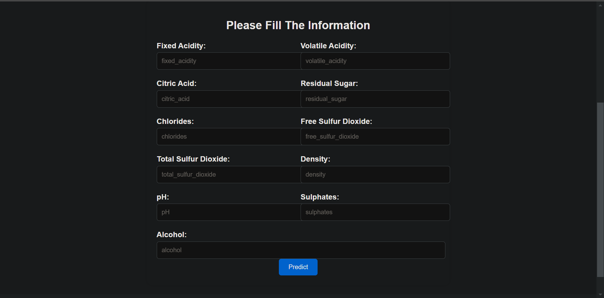
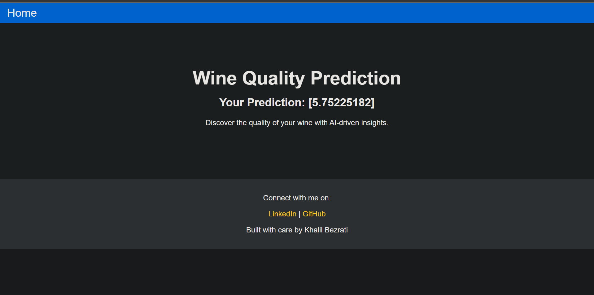
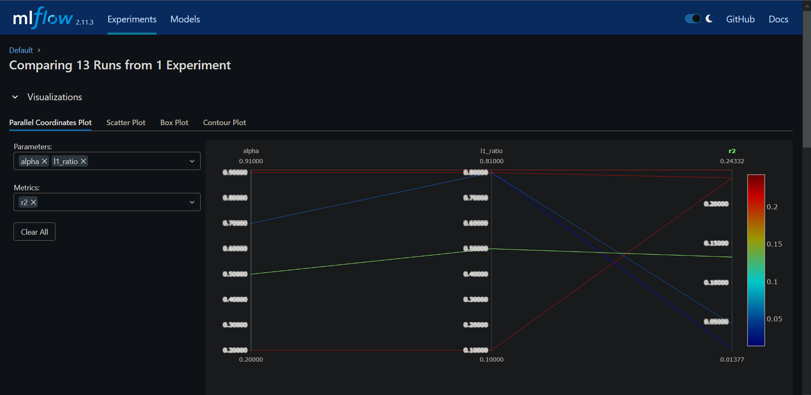

# Wine Quality Prediction Project

## Project Overview

This project is a comprehensive machine learning pipeline designed to predict wine quality using advanced data science techniques. The project follows a structured, modular approach to machine learning development, implementing best practices in data handling, model training, and evaluation.

## Project Development Journey

### 1. Project Initialization and Setup

The project began with careful project structure planning, creating a well-organized directory layout that follows machine learning project conventions:

- `src/mlProject/`: Core source code directory
- `research/`: Jupyter notebooks for experimental work
- `artifacts/`: Storage for generated data and models
- `config/`: Configuration management
- `templates/`: Web application templates

### 2. Data Ingestion Strategy

The data ingestion phase focused on systematically importing and preparing the wine quality dataset:

- Located in `src/mlProject/components/data_ingestion.py`
- Implemented robust data downloading and extraction mechanisms
- Stored raw and processed data in `artifacts/data_ingestion/`
- Created `winequality-red.csv` as the primary dataset

#### Key Achievements in Data Ingestion:
- Automated data retrieval
- Ensured data consistency
- Prepared dataset for further processing

### 3. Data Validation Process

Rigorous data validation was implemented to ensure data quality and integrity:

- Developed in `src/mlProject/components/data_validation.py`
- Performed comprehensive data checks
- Generated validation status in `artifacts/data_validation/status.txt`
- Verified dataset characteristics, missing values, and statistical properties

#### Validation Objectives:
- Confirm data completeness
- Identify potential data anomalies
- Ensure dataset readiness for machine learning

### 4. Data Transformation Techniques

The data transformation stage prepared the dataset for model training:

- Implemented in `src/mlProject/components/data_transformation.py`
- Performed feature scaling and encoding
- Split data into training and testing sets
- Stored processed datasets in `artifacts/data_transformation/`
  - `train.csv`
  - `test.csv`

#### Transformation Highlights:
- Normalized features
- Prepared data for model compatibility
- Ensured balanced train/test split

### 5. Model Training Approach

Model training was conducted with a focus on algorithm selection and hyperparameter tuning:

- Developed in `src/mlProject/components/model_trainer.py`
- Utilized advanced regression techniques
- Performed hyperparameter optimization
- Saved trained model in `artifacts/model_trainer/model.joblib`

#### Training Strategy:
- Explored multiple regression algorithms
- Used techniques like ElasticNet for robust prediction
- Focused on minimizing prediction errors

### 6. Model Evaluation Framework

Comprehensive model evaluation was implemented to assess performance:

- Located in `src/mlProject/components/model_evaluation.py`
- Calculated key regression metrics
- Generated `artifacts/model_evaluation/metrics.json`

#### Evaluation Metrics:
- Mean Absolute Error (MAE)
- Root Mean Square Error (RMSE)
- R-squared (R2) Score

### 7. MLflow Integration

Advanced experiment tracking was achieved using MLflow:

- Tracked in `mlruns/` directory
- Logged multiple experimental runs
- Captured:
  - Model hyper parameters
  - Performance metrics

  Example of regularization parameters tracking:

  
  

### 8. Prediction Pipeline

A dedicated prediction pipeline was created:

- Implemented in `src/mlProject/pipeline/prediction.py`
- Provides end-to-end prediction capabilities
- Supports seamless model deployment

### 9. Web Application

A simple web interface was developed:

- Located in `templates/`
- `index.html`: Input interface
- `results.html`: Prediction results display

## Technologies and Libraries

- Python
- Pandas
- Scikit-learn
- MLflow
- Flask
- Numpy

## Research and Experimentation

Jupyter notebooks in the `research/` directory documented the experimental process:

- Technique validation

## Continuous Integration

GitHub Actions workflow (`main.yaml`) set up for:
- Continuous Integration
- Continuous Delivery
- Continuous Depolyment

## Workflows

1. Update config.yaml
2. Update schema.yaml
3. Update params.yaml
4. Update the entity
5. Update the configuration manager in src config
6. Update the components
7. Update the pipeline 
8. Update the main.py
9. Update the app.py

  ecr_uri = 054037107074.dkr.ecr.eu-north-1.amazonaws.com/mlprojectwinequality